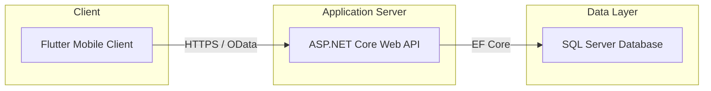

# Calendar Shop - PRM393 Mobile Application Development Project

Bộ mã nguồn mẫu (Starter) dành cho đề tài **Mobile App Bán Lịch Online** - Môn học PRM393 (FPT University). Dự án được thiết kế theo kiến trúc chuẩn Enterprise, chia làm hai tầng độc lập (Backend API & Flutter Frontend Client) đảm bảo hiệu năng và tính bảo mật.

---

##  Kiến Trúc Tổng Quan Hệ Thống

Hệ thống tuân thủ mô hình 3-tier tách biệt giữa Client, Server và Database:



### Cấu Trúc Thư Mục Dự Án
```text
calendar-shop/
├── mobile_flutter/       # Dự án Flutter Client (Android / iOS / Web)
├── backend_api/          # Dự án ASP.NET Core Web API (C# .NET 8)
└── sql/                  # Script khởi tạo cơ sở dữ liệu SQL Server
```

---

##  Công Nghệ Sử Dụng

### 📱 Mobile Client (Flutter)
*   **State Management:** Riverpod (`flutter_riverpod`) kết hợp với **Freezed** cho Immutable State.
*   **API Client:** Dio (`dio`) tích hợp logger định dạng và xử lý Token tự động.
*   **Mã hóa cục bộ:** `flutter_secure_storage` để lưu trữ Token JWT bảo mật.
*   **Routing:** `go_router` hỗ trợ điều hướng dạng Declarative Routing.
*   **Caching hình ảnh:** `cached_network_image` tối ưu hóa băng thông tải ảnh.

### 💻 Backend Web API (ASP.NET Core)
*   **Database ORM:** Entity Framework Core (SQL Server integration).
*   **Query Engine:** Microsoft.AspNetCore.OData (hỗ trợ client lọc/phân trang/chọn cột động).
*   **Mapping:** AutoMapper (`ProjectTo` & `Map` thông qua dependency injection).
*   **Validation:** FluentValidation MVC Auto-Validation.
*   **Logging:** Serilog structured console logging.
*   **Security:** Authentication qua JWT Bearer Token.

---

##  Hướng Dẫn Cài Đặt Nhanh

### Bước 1: Thiết lập Cơ sở dữ liệu SQL Server
1.  Mở phần mềm **SQL Server Management Studio (SSMS)**.
2.  Mở và thực thi (Execute) file script SQL:
    [CalendarShopDB.sql](file:///e:/D/study/HK8/PRM393/.FinalProject/calendar-shop/sql/CalendarShopDB.sql)
3.  Cơ sở dữ liệu mặc định sẽ được khởi tạo với tên: `CalendarShopDB` cùng các bảng và dữ liệu mẫu đầy đủ.

### Bước 2: Chạy Backend API
1.  Mở terminal tại thư mục dự án backend:
    ```bash
    cd backend_api/CalendarShop.Api
    ```
2.  Kiểm tra và sửa chuỗi kết nối (Connection String) trong file `appsettings.Development.json` cho khớp với SQL Server của bạn.
3.  Chạy các lệnh để khởi động:
    ```bash
    dotnet restore
    dotnet run
    ```
4.  Truy cập Swagger UI để kiểm thử API tại địa chỉ:
    [http://localhost:52441/swagger](http://localhost:52441/swagger) (hoặc cổng ngẫu nhiên hiển thị trên console).

### Bước 3: Chạy ứng dụng Flutter
1.  Mở terminal tại thư mục dự án mobile:
    ```bash
    cd mobile_flutter
    ```
2.  Chạy lệnh để cài đặt thư viện và sinh code tự động:
    ```bash
    flutter pub get
    dart run build_runner build --delete-conflicting-outputs
    ```
3.  Kết nối thiết bị hoặc khởi động Emulator rồi chạy app:
    ```bash
    flutter run
    ```

> [!TIP]
> - Nếu chạy bằng Android Emulator, base URL kết nối API mặc định đã được cấu hình trỏ về cổng ảo `10.0.2.2`.
> - Nếu chạy trên thiết bị thật (Real Device), bạn cần đổi cổng IP về IP máy chủ phát WiFi của mình trong file [api_constants.dart](file:///e:/D/study/HK8/PRM393/.FinalProject/calendar-shop/mobile_flutter/lib/core/constants/api_constants.dart).

---

##  Tài Khoản Thử Nghiệm Có Sẵn

Dữ liệu mẫu sau khi chạy file SQL đã cung cấp sẵn hai tài khoản sau để demo:

*   **Tài khoản Admin:**
    *   **Email:** `admin@calendarshop.com`
    *   **Mật khẩu:** `123456`
*   **Tài khoản Customer:**
    *   **Email:** `customer@gmail.com`
    *   **Mật khẩu:** `123456`

---

## 👥 Hướng Dẫn Git Nhóm & Phân Nhánh (Branch)

### Tạo repository riêng cho nhóm:
```bash
git init
git add .
git commit -m "Init: Calendar Shop Clean Architecture Starter Project"
git branch -M main
git remote add origin <url_repo_nhom_cua_ban>
git push -u origin main
```

### Phân công nhánh làm việc (Không commit trực tiếp lên `main`):
*   Tính năng Auth & Profile: `feature/auth-profile`
*   Tính năng Sản phẩm & Danh mục: `feature/product-category`
*   Tính năng Giỏ hàng & Đặt hàng: `feature/cart-order`
*   Tính năng Yêu thích & Đánh giá: `feature/favorite-review`
*   Tính năng Quản trị & Dashboard: `feature/admin-management`
