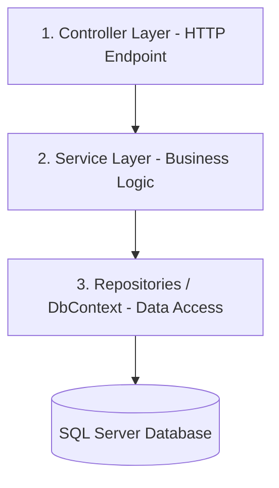
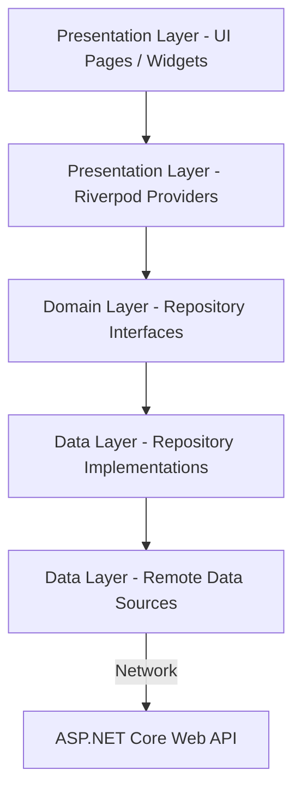

# Hướng Dẫn Kiến Trúc & Tiêu Chuẩn Lập Trình Dự Án (Comprehensive Developer & AI Coding Guide)

Tài liệu này định nghĩa **kiến trúc bắt buộc** và **hướng dẫn sử dụng các thư viện cốt lõi** trong dự án. Mọi lập trình viên và các AI Coding Assistant khi viết code cho dự án này phải tuân thủ nghiêm ngặt các quy tắc dưới đây.

---

## 🏗️ PHẦN I: TIÊU CHUẨN KIẾN TRÚC & RANH GIỚI BẮT BUỘC

### 1. Kiến Trúc Backend (.NET Core Web API)

Mô hình kiến trúc Backend được phân tách thành 3 lớp độc lập:



- **Lớp Controller (Biên giới HTTP):** Chỉ tiếp nhận HTTP Request, kiểm tra phân quyền JWT (`[Authorize]`) và trả về HTTP Status Code. **Cấm** tiêm trực tiếp `AppDbContext` vào đây. Mọi thao tác lấy danh sách phải dùng thuộc tính `[EnableQuery]` của OData.
- **Lớp Service (Business Logic):** Chứa toàn bộ nghiệp vụ ứng dụng. **Cấm** trả về HTTP Status Code. Nếu có lỗi, bắt buộc quăng (throw) Exception. Sử dụng AutoMapper để map thực thể DB thành DTO trước khi trả về Controller.
- **Lớp Repositories / DbContext:** Chỉ làm việc trực tiếp với database. Phải trả về kiểu `IQueryable<T>` để tối ưu hóa việc truy vấn trì hoãn.

---

### 2. Kiến Trúc Frontend (Flutter Clean Architecture)

Mã nguồn Flutter được tổ chức theo Clean Architecture phân chia theo từng Feature (Auth, Product, Cart, Order).



- **Lớp Presentation (Giao diện & Trạng thái):** Chứa UI và các Riverpod Provider. **Cấm** gọi trực tiếp các lớp của Data Layer hoặc API. State quản lý bởi Riverpod bắt buộc phải bất biến (Immutable) và cập nhật qua `copyWith` của Freezed.
- **Lớp Domain (Lõi nghiệp vụ sạch):** **Độc lập hoàn toàn**, cấm import bất kỳ file nào từ Data Layer hay Presentation Layer. Chứa các class Entity sạch (không có hàm parse JSON) và các interface Repository.
- **Lớp Data (Hạ tầng dữ liệu):** Gọi API mạng qua Dio, trả về Model DTO. Tại lớp Repository Implementation, **bắt buộc** phải chuyển đổi Model DTO thành Entity của Domain thông qua phương thức `.toEntity()` trước khi trả kết quả về cho Presentation Layer.

---

## 🛠️ PHẦN II: HƯỚNG DẪN CHI TIẾT SỬ DỤNG THƯ VIỆN BACKEND (.NET)

### 1. Truy vấn Động OData (Query Engine)

Thay vì viết code lọc, sắp xếp, phân trang thủ công ở Backend, hãy cấu hình OData và để Client tự truy vấn linh hoạt thông qua URL.

- **Khai báo EDM Model (Program.cs):**
  ```csharp
  static IEdmModel GetEdmModel()
  {
      var builder = new ODataConventionModelBuilder();
      builder.EntitySet<ProductDto>("Products").EntityType.HasKey(x => x.ProductId);
      return builder.GetEdmModel();
  }
  ```
- **Cấu hình Action Controller:**
  ```csharp
  [HttpGet]
  [EnableQuery] // Bật các tính năng truy vấn động
  public ActionResult<IQueryable<ProductDto>> GetAll()
  {
      var query = _productService.GetAllProductsQuery();
      return Ok(query);
  }
  ```
- **Các cú pháp OData phổ biến Client/AI có thể dùng ngay:**
  - **Lọc dữ liệu:** `GET /api/Products?$filter=price gt 100000 and status eq 'Active'`
  - **Chọn cột (Giảm băng thông):** `GET /api/Products?$select=productId,productName,price`
  - **Sắp xếp:** `GET /api/Products?$orderby=price desc`
  - **Phân trang:** `GET /api/Products?$top=10&$skip=20&$count=true`

---

### 2. Ánh Xạ Đối Tượng AutoMapper

Để giải phóng việc viết tay code map dữ liệu và hỗ trợ tối ưu hóa truy vấn thông qua cơ chế chiếu dữ liệu (Projection), giúp EF Core sinh câu lệnh SQL SELECT chính xác các cột cần thiết thay vì truy vấn toàn bộ cột dữ liệu từ bảng.

- **Quy tắc:**
  1.  Tạo lớp cấu hình Mapping kế thừa từ `Profile` trong thư mục `Mappings/`:
      ```csharp
      public class ProductMappingProfile : Profile
      {
          public ProductMappingProfile()
          {
              CreateMap<Product, ProductDto>()
                  .ForMember(dest => dest.CategoryName, opt => opt.MapFrom(src => src.Category.CategoryName));
          }
      }
      ```
  2.  Sử dụng `.ProjectTo<TDto>(_mapper.ConfigurationProvider)` trên `IQueryable` để EF Core tự dịch thành câu lệnh SQL SELECT cột đích danh:
      ```csharp
      public IQueryable<ProductDto> GetAllProductsQuery()
      {
          return _db.Products.Where(x => !x.IsDeleted)
              .ProjectTo<ProductDto>(_mapper.ConfigurationProvider);
      }
      ```

---

### 3. Tự Động Bắt Lỗi Dữ Liệu FluentValidation

- **Quy tắc:** Tạo Validator class kế thừa từ `AbstractValidator<RequestDto>` đặt trong thư mục `Validators/` để hệ thống tự động validate tham số API đầu vào.
  ```csharp
  public class ProductCreateUpdateDtoValidator : AbstractValidator<ProductCreateUpdateDto>
  {
      public ProductCreateUpdateDtoValidator()
      {
          RuleFor(x => x.ProductName).NotEmpty().WithMessage("Tên sản phẩm không được để trống.");
          RuleFor(x => x.Price).GreaterThan(0).WithMessage("Giá sản phẩm phải lớn hơn 0.");
      }
  }
  ```

---

## 📱 PHẦN III: HƯỚNG DẪN CHI TIẾT SỬ DỤNG THƯ VIỆN FRONTEND (Flutter)

### 1. Riverpod State Management & Immutability

- **Quy tắc:** Quản lý state bất biến. Khi cập nhật trạng thái UI, dùng hàm `.copyWith()` để nhân bản và thay đổi dữ liệu, kích hoạt re-render UI.
- **Code mẫu quản lý State:**

  ```dart
  class CartNotifier extends StateNotifier<List<CartItemEntity>> {
    CartNotifier() : super([]);

    void updateQuantity(int itemId, int newQuantity) {
      state = [
        for (final item in state)
          if (item.cartItemId == itemId)
            item.copyWith(quantity: newQuantity, lineTotal: item.price * newQuantity)
          else
            item
      ];
    }
  }
  ```

---

### 2. Tạo Model bằng Freezed & JSON Serialization

Tất cả các Model DTO ở Data Layer bắt buộc phải khai báo bằng Freezed để tự động sinh code.

- **Định nghĩa File Model (`product_model.dart`):**

  ```dart
  import 'package:freezed_annotation/freezed_annotation.dart';
  import '../../domain/entities/product.dart';

  part 'product_model.freezed.dart';
  part 'product_model.g.dart';

  @freezed
  class ProductModel with _$ProductModel {
    const factory ProductModel({
      required int productId,
      required int categoryId,
      String? categoryName,
      required String productName,
      required double price,
      required int stockQuantity,
      String? imageUrl,
      required String calendarType,
      required String status,
      required DateTime createdAt,
    }) = _ProductModel;

    factory ProductModel.fromJson(Map<String, dynamic> json) =>
        _$ProductModelFromJson(json);
  }
  ```

- **Lệnh biên dịch sinh code tự động (Bắt buộc chạy sau khi sửa/tạo model):**
  ```bash
  dart run build_runner build --delete-conflicting-outputs
  ```

---

### 3. Ranh Giới Chuyển Đổi Model DTO sang Entity (`toEntity`)

Để đảm bảo lớp UI không bị phụ thuộc vào định dạng JSON của API, ta chuyển đổi Model DTO thành Entity của Domain tại lớp Repository Implementation bằng hàm `.toEntity()`.

- **Khai báo Extension (`product_model.dart`):**
  ```dart
  extension ProductModelMapper on ProductModel {
    Product toEntity() => Product(
          productId: productId,
          categoryId: categoryId,
          categoryName: categoryName,
          productName: productName,
          price: price,
          stockQuantity: stockQuantity,
          imageUrl: imageUrl,
          calendarType: calendarType,
          status: status,
          createdAt: createdAt,
        );
  }
  ```
- **Sử dụng trong Repository Implementation:**
  ```dart
  @override
  Future<Product> getProductById(int id) async {
    final model = await remoteDataSource.getProductById(id);
    return model.toEntity(); // Trả Entity sạch về cho UI
  }
  ```

---

### 4. Lưu Trữ Bảo Mật (Flutter Secure Storage)

- **Quy tắc:** Lưu trữ JWT Token hoặc dữ liệu nhạy cảm mã hóa đầu cuối.

  ```dart
  import 'package:flutter_secure_storage/flutter_secure_storage.dart';

  class TokenStorage {
    final _storage = const FlutterSecureStorage();

    Future<void> saveToken(String token) async {
      await _storage.write(key: 'access_token', value: token);
    }

    Future<String?> getToken() async {
      return await _storage.read(key: 'access_token');
    }
  }
  ```

---

### 5. Định Dạng Logs bằng Logger

- **Quy tắc:** Sử dụng `logger` thay cho `print` để in các log biên dịch đẹp mắt và phân vùng rõ ràng.

  ```dart
  import 'package:logger/logger.dart';

  final logger = Logger(
    printer: PrettyPrinter(
      methodCount: 0,
      errorMethodCount: 5,
      lineLength: 80,
      colors: true,
      printEmojis: true,
    ),
  );

  // Cách sử dụng:
  logger.i("Thông tin ứng dụng");
  logger.e("Báo lỗi hệ thống!");
  ```

---

## 🛡️ PHẦN IV: QUY ƯỚC ERROR RESPONSE & ĐỊNH HƯỚNG TRUY VẤN (OData vs REST)

### 1. Quy ước Error Response (RFC 7807 Problem Details)

Mọi lỗi trả về từ API Backend phải tuân thủ chuẩn **RFC 7807 (Problem Details)** để đảm bảo tính nhất quán và dễ dàng xử lý ở phía Client (Flutter).

- **Mã phản hồi HTTP thành công:** `200 OK`, `201 Created`, `204 No Content`.
- **Mã phản hồi HTTP lỗi phổ biến:**
  - `400 Bad Request`: Lỗi dữ liệu đầu vào không hợp lệ (Validation), lỗi định dạng logic.
  - `401 Unauthorized`: Lỗi chưa đăng nhập hoặc Token hết hạn/không hợp lệ.
  - `403 Forbidden`: Người dùng đã đăng nhập nhưng không có quyền truy cập tài nguyên (Role không khớp).
  - `404 Not Found`: Không tìm thấy tài nguyên yêu cầu.
  - `500 Internal Server Error`: Lỗi hệ thống không lường trước hoặc crash server.

- **Định dạng JSON chuẩn (ProblemDetails):**
  ```json
  {
    "type": "https://tools.ietf.org/html/rfc7231#section-6.5.1",
    "title": "One or more validation errors occurred.",
    "status": 400,
    "detail": "Tên sản phẩm đã tồn tại trong hệ thống.",
    "instance": "/api/Products",
    "code": "DUPLICATE_PRODUCT_NAME", // Mã lỗi nghiệp vụ cụ thể (Business Error Code)
    "errors": {
      "ProductName": ["Tên sản phẩm không được trùng lặp."]
    }
  }
  ```

- **Xử lý và Parse lỗi ở Flutter:**
  - Định nghĩa cấu trúc lỗi thông qua `Failure` hoặc `AppException`. Khi nhận được `DioException` từ Remote Data Source, bắt buộc phải parse thông báo lỗi chi tiết từ `errors` hoặc `detail` trước khi đưa ra UI.
  - **Mẫu xử lý lỗi trong Flutter Repository Implementation:**
    ```dart
    String extractErrorMessage(DioException exception) {
      if (exception.response?.data != null && exception.response?.data is Map) {
        final data = exception.response!.data as Map<String, dynamic>;
        if (data.containsKey('errors')) {
          final errors = data['errors'] as Map<String, dynamic>;
          if (errors.isNotEmpty) {
            final firstKey = errors.keys.first;
            final firstList = errors[firstKey] as List;
            if (firstList.isNotEmpty) {
              return firstList.first.toString();
            }
          }
        }
        if (data.containsKey('detail')) {
          return data['detail'].toString();
        }
      }
      return exception.message ?? "Đã xảy ra lỗi hệ thống";
    }
    ```

---

### 2. Khi Nào Dùng OData và Khi Nào Dùng Endpoint Thường?

Dự án cần áp dụng đúng công cụ cho từng bài toán để tối ưu hiệu năng và thời gian phát triển:

- **Sử dụng OData cho:**
  - Các API **Query** (lấy danh sách thực thể) cần cung cấp khả năng tìm kiếm, lọc (`$filter`), sắp xếp (`$orderby`), phân trang (`$top`, `$skip`), hoặc chọn cột (`$select`) linh hoạt cho Client mà không cần viết thêm code nghiệp vụ ở Backend.
  - Ví dụ: Lọc danh sách sản phẩm theo giá và loại lịch, phân trang danh sách đơn hàng của Admin.
  - Lớp Service bắt buộc trả về `IQueryable<T>` và Controller đánh dấu thuộc tính `[EnableQuery]`.
- **Sử dụng Endpoint REST thường cho:**
  - Các API **Command/Mutation** thay đổi trạng thái: tạo mới (`POST`), cập nhật (`PUT/PATCH`), xóa/ẩn (`DELETE`).
  - API lấy chi tiết của 1 bản ghi cụ thể theo ID: `GET /api/Products/{id}` (do không cần query động phức tạp).
  - Các API tích hợp nghiệp vụ phức tạp, nhiều bước: Đăng nhập (`POST /api/Auth/login`), Đặt hàng (`POST /api/Orders/checkout`), Thanh toán, Xác thực OTP.
  - Các API cần caching phản hồi tĩnh ở Gateway/CDN hoặc các API có nghiệp vụ kiểm soát quyền truy cập cực kỳ khắt khe theo từng bản ghi riêng biệt.

---

## 📁 PHẦN V: QUY ƯỚC ĐẶT TÊN & TỔ CHỨC THƯ MỤC (Folder & Feature Naming)

### 1. Quy ước trên Backend (.NET)

Mã nguồn Backend tổ chức theo cấu trúc Layered kết hợp phân cụm theo Entity chính.

- **Quy tắc đặt tên:**
  - Mọi thư mục, tên lớp (Class), tên interface, tên phương thức, tên thuộc tính public đều dùng **PascalCase**.
  - Tên interface bắt đầu bằng chữ `I` (ví dụ: `IProductService.cs`).
  - Các lớp triển khai (Implementations) nằm cùng thư mục hoặc thư mục con tương ứng (ví dụ: `ProductService.cs` triển khai `IProductService.cs`).
  - Đặt tên file theo cấu trúc `<Entity><Suffix>` (ví dụ: `ProductService.cs`, `ProductDto.cs`, `ProductMappingProfile.cs`).

- **Cấu trúc thư mục chuẩn:**
  ```text
  CalendarShop.Api/
  ├── Controllers/           # Chứa các Controller tiếp nhận HTTP Request
  │   ├── AuthController.cs
  │   ├── ProductsController.cs
  │   └── OrdersController.cs
  ├── Services/              # Chứa các Interface & Class xử lý Business Logic
  │   ├── IProductService.cs
  │   ├── ProductService.cs
  │   ├── ICartService.cs
  │   └── CartService.cs
  ├── Dtos/                  # Data Transfer Objects trao đổi giữa Client và API
  │   ├── ProductDtos.cs
  │   ├── OrderDtos.cs
  │   └── AuthDtos.cs
  ├── Models/                # Thực thể Database (EF Core Entities)
  │   ├── Product.cs
  │   ├── Order.cs
  │   └── AppUser.cs
  ├── Mappings/              # Cấu hình AutoMapper Profile
  │   └── ProductMappingProfile.cs
  └── Validators/            # Định nghĩa các luật validation đầu vào
      └── ProductValidator.cs
  ```

---

### 2. Quy ước trên Frontend (Flutter)

Mã nguồn Flutter bắt buộc phải tổ chức theo dạng **Feature-First** trong Clean Architecture để dễ mở rộng và bảo trì.

- **Quy tắc đặt tên:**
  - Tất cả các thư mục, file mã nguồn Dart, assets phải dùng **snake_case** (chữ thường ngăn cách bởi dấu gạch dưới). Ví dụ: `product_detail_page.dart`.
  - Tên Class, Enum, Mixin dùng **PascalCase** (ví dụ: `ProductRepositoryImpl`).
  - Tên biến, hàm dùng **camelCase** (ví dụ: `getProductById`).
  - Quy ước hậu tố file bắt buộc phản ánh vai trò của nó: `_page.dart`, `_widget.dart`, `_provider.dart`, `_repository.dart`, `_model.dart`, `_entity.dart`.

- **Cấu trúc một Feature chuẩn (ví dụ: `product`):**
  ```text
  lib/features/product/
  ├── domain/                # Lõi nghiệp vụ sạch (Không phụ thuộc thư viện bên ngoài)
  │   ├── entities/          # Đối tượng nghiệp vụ sạch (chỉ chứa data + logic nghiệp vụ)
  │   │   └── product.dart
  │   └── repositories/      # Định nghĩa các interface repository
  │       └── product_repository.dart
  ├── data/                  # Nguồn dữ liệu & Cấu trúc DTOs
  │   ├── datasources/       # Gọi API mạng qua Dio (Remote) hoặc Cache local (Local)
  │   │   └── product_remote_data_source.dart
  │   ├── models/            # Đối tượng DTO chứa hàm parse JSON (dùng Freezed)
  │   │   ├── product_model.dart
  │   │   ├── product_model.freezed.dart
  │   │   └── product_model.g.dart
  │   └── repositories/      # Triển khai interface repository từ Domain
  │       └── product_repository_impl.dart
  └── presentation/          # Giao diện người dùng & Trạng thái
      ├── providers/         # Quản lý State bằng Riverpod StateNotifierProvider/Notifier
      │   └── product_provider.dart
      ├── pages/             # Các Widget màn hình chính
      │   ├── product_list_page.dart
      │   └── product_detail_page.dart
      └── widgets/           # Các Widget nhỏ, tái sử dụng nội bộ
          └── product_card_widget.dart
  ```

---

## 🧪 PHẦN VI: TIÊU CHUẨN KIỂM THỬ TỐI THIỂU (Minimum Testing Requirements)

Để đảm bảo chất lượng phần mềm khi vận hành thực tế ở cấp độ Enterprise, mọi tính năng được phát triển cần phải đi kèm với hệ thống test tự động tối thiểu.

### 1. Kiểm thử trên Backend (.NET)

- **Yêu cầu:** Viết **Unit Test** cho lớp **Service** nơi chứa nghiệp vụ logic chính. Không bắt buộc test Controller (đã được Swagger/Postman test tay) và DbContext (EF Core tích hợp sẵn).
- **Công cụ:** Sử dụng **xUnit**, **Moq** (để giả lập các tầng phụ thuộc như DbContext/Repository), và **FluentAssertions** (để viết mã assertion dễ đọc).
- **Quy tắc đặt tên hàm test:** `TenPhuongThuc_TrangThaiDauVao_KetQuaMongMuon`
- **Ví dụ mã kiểm thử Service:**
  ```csharp
  public class ProductServiceTests
  {
      private readonly Mock<AppDbContext> _mockContext;
      private readonly Mock<IMapper> _mockMapper;
      private readonly ProductService _service;

      public ProductServiceTests()
      {
          _mockContext = new Mock<AppDbContext>();
          _mockMapper = new Mock<IMapper>();
          _service = new ProductService(_mockContext.Object, _mockMapper.Object);
      }

      [Fact]
      public async Task GetProductById_WhenProductExists_ReturnsProductDto()
      {
          // Arrange: Chuẩn bị dữ liệu mẫu và giả lập hành vi
          var productId = 1;
          var product = new Product { ProductId = productId, ProductName = "Lịch Treo Tường", Price = 150000 };
          var expectedDto = new ProductDto { ProductId = productId, ProductName = "Lịch Treo Tường", Price = 150000 };
          
          // Giả lập DbContext truy vấn
          // ...
          
          // Act: Thực thi phương thức cần test
          var result = await _service.GetProductByIdAsync(productId);

          // Assert: Kiểm tra kết quả
          result.Should().NotBeNull();
          result.ProductName.Should().Be("Lịch Treo Tường");
      }
  }
  ```

---

### 2. Kiểm thử trên Frontend (Flutter)

Mức độ kiểm thử tối thiểu trên Flutter bao gồm Unit Test cho Mapper và Widget Test cho màn hình cốt lõi.

- **Unit Test cho Mapper:** Kiểm tra các hàm chuyển đổi từ DTO Model sang Domain Entity (`toEntity()`) nhằm phát hiện sớm các lỗi sai kiểu dữ liệu (TypeError) hoặc gán sai trường khi parse JSON từ API.
  - Ví dụ test trong `test/model_mapping_test.dart`:
    ```dart
    void main() {
      test('ProductModel toEntity should map values correctly', () {
        final model = ProductModel(
          productId: 1,
          categoryId: 10,
          productName: 'Calendar 2026',
          price: 150000,
          stockQuantity: 50,
          calendarType: 'Wall',
          status: 'Active',
          createdAt: DateTime.now(),
        );

        final entity = model.toEntity();

        expect(entity.productId, model.productId);
        expect(entity.productName, model.productName);
        expect(entity.price, model.price);
      });
    }
    ```

- **Widget Test cho màn hình:** Mỗi feature lớn phải có tối thiểu 1 Widget Test cho màn hình chính (ví dụ: màn hình Login hoặc màn hình Danh sách sản phẩm) để kiểm thử giao diện có render đúng các element quan trọng và tương tác nhấn nút có diễn ra bình thường hay không.
  - Ví dụ kiểm thử Login Page:
    ```dart
    void main() {
      testWidgets('LoginPage renders input fields and login button', (WidgetTester tester) async {
        // Build widget trong môi trường test
        await tester.pumpWidget(
          const ProviderScope(
            child: MaterialApp(
              home: LoginPage(),
            ),
          ),
        );

        // Kiểm tra xem các ô nhập liệu và nút bấm có tồn tại không
        expect(find.byType(TextField), findsNWidgets(2)); // Email & Password
        expect(find.text('Đăng nhập'), findsOneWidget);

        // Giả lập tương tác nhập chữ và nhấn nút
        await tester.enterText(find.byType(TextField).first, 'admin@calendarshop.com');
        await tester.tap(find.text('Đăng nhập'));
        await tester.pump(); // Cập nhật lại UI sau sự kiện
      });
    }
    ```

