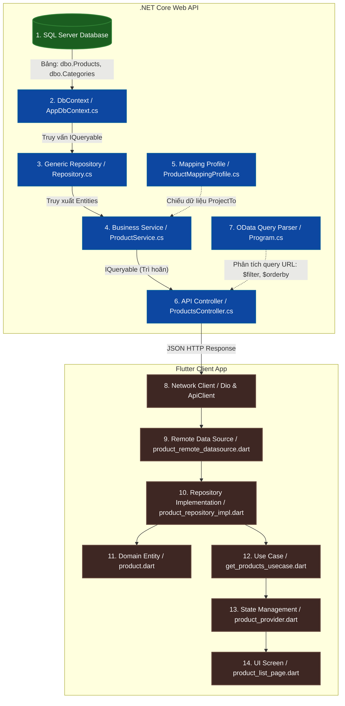

# Luồng Dữ Liệu Catalog (Product & Category) Từ Backend Đến Frontend

Tài liệu này mô tả chi tiết luồng xử lý dữ liệu của tính năng Sản phẩm (Product) và Danh mục (Category) từ Cơ sở dữ liệu SQL Server ở Backend cho đến màn hình giao diện người dùng ở Frontend (Flutter Mobile Client).

---

## 📊 SƠ ĐỒ LUỒNG DỮ LIỆU (DATAFlow MERMAID DIAGRAM)



---

## 🔍 CHI TIẾT CÁC BƯỚC XỬ LÝ (STEP-BY-STEP NODES)

### 1. Backend Layer (Từ DB đến Controller Endpoint)

#### Bước 1: SQL Server Database
*   **Thực thể:** Bảng `dbo.Products` và `dbo.Categories` trong [CalendarShopDB.sql](file:///e:/D/study/HK8/PRM393/.FinalProject/calendar-shop/sql/CalendarShopDB.sql).
*   **Nhiệm vụ:** Lưu trữ vật lý dữ liệu sản phẩm, số lượng tồn kho, giá cả và liên kết khóa ngoại (`CategoryId`).

#### Bước 2: Entity Framework Core DbContext
*   **File tương ứng:** [AppDbContext.cs](file:///e:/D/study/HK8/PRM393/.FinalProject/calendar-shop/backend_api/CalendarShop.Api/Data/AppDbContext.cs).
*   **Đầu vào:** Kết nối SQL Server qua Connection String.
*   **Nhiệm vụ:** Ánh xạ các bảng SQL thành các tập hợp thực thể `DbSet<Product>` và `DbSet<Category>`.

#### Bước 3: Generic Repository Layer
*   **File tương ứng:** 
    *   [IRepository.cs](file:///e:/D/study/HK8/PRM393/.FinalProject/calendar-shop/backend_api/CalendarShop.Api/Repositories/IRepository.cs)
    *   [Repository.cs](file:///e:/D/study/HK8/PRM393/.FinalProject/calendar-shop/backend_api/CalendarShop.Api/Repositories/Repository.cs)
*   **Đầu vào:** Nhận `AppDbContext` thông qua Dependency Injection.
*   **Nhiệm vụ:** Cung cấp thuộc tính `Entities` trả về `IQueryable<T>` để cho phép các lớp phía trên xây dựng các câu lệnh truy vấn trì hoãn (Deffered Execution), tối ưu truy vấn SQL Server.

#### Bước 4: Service Layer (Business Logic)
*   **File tương ứng:** [ProductService.cs](file:///e:/D/study/HK8/PRM393/.FinalProject/calendar-shop/backend_api/CalendarShop.Api/Services/ProductService.cs).
*   **Đầu vào:** Nhận `IRepository<Product>` và `IMapper`.
*   **Hoạt động:**
    1. Lấy tập hợp thực thể: `_productRepository.Entities`.
    2. Áp dụng bộ lọc cơ bản (ví dụ ẩn sản phẩm bị xóa `!x.IsDeleted` hoặc ẩn sản phẩm ngưng bán `x.Status == "Active"`).
    3. Sử dụng AutoMapper `.ProjectTo<ProductDto>(_mapper.ConfigurationProvider)` để ánh xạ trực tiếp từ thực thể DB sang `ProductDto` ngay trên SQL Server (chỉ lấy các cột cần thiết).
*   **Đầu ra:** Trả về một `IQueryable<ProductDto>` (chưa thực thi truy vấn xuống DB).

#### Bước 5: AutoMapper Profile
*   **File tương ứng:** [ProductMappingProfile.cs](file:///e:/D/study/HK8/PRM393/.FinalProject/calendar-shop/backend_api/CalendarShop.Api/Mappings/ProductMappingProfile.cs).
*   **Nhiệm vụ:** Cấu hình quy tắc ánh xạ giữa `Product` và `ProductDto` (ví dụ lấy tên danh mục `CategoryName` từ bảng liên kết `Category`).

#### Bước 6: API Controller (OData Endpoint)
*   **File tương ứng:** [ProductsController.cs](file:///e:/D/study/HK8/PRM393/.FinalProject/calendar-shop/backend_api/CalendarShop.Api/Controllers/ProductsController.cs).
*   **Đầu vào:** Request HTTP GET gửi tới `/api/Products` kèm query params OData (ví dụ: `?$filter=CategoryId eq 1`).
*   **Hoạt động:** 
    1. Nhận `IQueryable<ProductDto>` từ `ProductService`.
    2. OData Middleware (được cấu hình trong [Program.cs](file:///e:/D/study/HK8/PRM393/.FinalProject/calendar-shop/backend_api/CalendarShop.Api/Program.cs)) tự động bắt các tham số truy vấn trên URL, dịch thành câu lệnh SQL bổ sung (`WHERE`, `ORDER BY`, `OFFSET/FETCH`).
    3. Thực thi truy vấn xuống SQL Server và nhận dữ liệu thật về.
*   **Đầu ra:** Trả về HTTP Status `200 OK` với JSON định dạng camelCase có cấu trúc:
    ```json
    {
      "value": [
        { "productId": 1, "productName": "Lịch để bàn", "price": 65000.0, ... }
      ]
    }
    ```

---

### 2. Frontend Layer (Từ HTTP Client đến UI hiển thị)

#### Bước 7: Network Client
*   **File tương ứng:** [api_client.dart](file:///e:/D/study/HK8/PRM393/.FinalProject/calendar-shop/mobile_flutter/lib/core/network/api_client.dart).
*   **Nhiệm vụ:** Đóng vai trò lớp vận chuyển, tự động gắn Header JWT Bearer token vào request, xử lý lỗi tập trung và xử lý Auto-Refresh Token khi nhận mã lỗi HTTP 401.

#### Bước 8: Remote Data Source
*   **File tương ứng:** [product_remote_datasource.dart](file:///e:/D/study/HK8/PRM393/.FinalProject/calendar-shop/mobile_flutter/lib/features/product/data/datasources/product_remote_datasource.dart).
*   **Đầu vào:** Tham số từ các hàm của Dart (ví dụ: `categoryId: 1`, `search: "Lịch"`).
*   **Hoạt động:**
    1. Biên dịch các tham số thành cú pháp OData `$filter` và `$orderby`. Ví dụ:
       *   `CategoryId eq 1`
       *   `contains(tolower(ProductName), 'lịch')`
    2. Gửi request HTTP GET qua `ApiClient`.
    3. Trích xuất mảng JSON trong trường `value` của API trả về.
    4. Parse mảng JSON thành danh sách thực thể data `List<ProductModel>` bằng hàm khởi tạo tự động `ProductModel.fromJson()`.
*   **Đầu ra:** `Future<List<ProductModel>>`.

#### Bước 9: Repository Implementation (Data Layer)
*   **File tương ứng:** [product_repository_impl.dart](file:///e:/D/study/HK8/PRM393/.FinalProject/calendar-shop/mobile_flutter/lib/features/product/data/repositories/product_repository_impl.dart).
*   **Đầu vào:** Nhận `ProductRemoteDataSource`.
*   **Hoạt động:** 
    1. Gọi hàm lấy dữ liệu từ Remote Data Source.
    2. Chuyển đổi (Map) các Model DTO dữ liệu thô (`ProductModel`) thành các thực thể nghiệp vụ sạch ở tầng Domain (`Product` Entity) thông qua hàm mở rộng `.toEntity()`.
*   **Đầu ra:** `Future<List<Product>>` (Trả thực thể sạch, không chứa logic JSON về phía UI).

#### Bước 10: Domain Layer (Entity & Repository Interface)
*   **Files tương ứng:** 
    *   Entity: [product.dart](file:///e:/D/study/HK8/PRM393/.FinalProject/calendar-shop/mobile_flutter/lib/features/product/domain/entities/product.dart)
    *   Interface: [product_repository.dart](file:///e:/D/study/HK8/PRM393/.FinalProject/calendar-shop/mobile_flutter/lib/features/product/domain/repositories/product_repository.dart)
*   **Nhiệm vụ:** Định nghĩa lớp dữ liệu nghiệp vụ tinh khiết (không phụ thuộc bất kỳ thư viện bên ngoài hay cấu trúc JSON nào) và định nghĩa giao diện (Interface) mà lớp Data bắt buộc phải tuân thủ.

#### Bước 11: Domain Use Cases
*   **File tương ứng:** [get_products_usecase.dart](file:///e:/D/study/HK8/PRM393/.FinalProject/calendar-shop/mobile_flutter/lib/features/product/domain/usecases/get_products_usecase.dart).
*   **Nhiệm vụ:** Bao bọc một luồng nghiệp vụ độc lập duy nhất (ví dụ: lấy danh sách sản phẩm theo bộ lọc). Lớp này gọi Repository để lấy dữ liệu.

#### Bước 12: Riverpod Providers (Presentation State)
*   **File tương ứng:** [product_provider.dart](file:///e:/D/study/HK8/PRM393/.FinalProject/calendar-shop/mobile_flutter/lib/features/product/presentation/providers/product_provider.dart).
*   **Nhiệm vụ:** 
    1. Tiêu thụ UseCase để nạp dữ liệu.
    2. Quản lý trạng thái bất biến (Immutable State) của danh sách sản phẩm (Ví dụ: trạng thái `AsyncValue` gồm Loading, Success, Error).
    3. Cung cấp State này để UI lắng nghe và tự động Re-render.

#### Bước 13: UI Screen (Giao diện)
*   **File tương ứng:** [product_list_page.dart](file:///e:/D/study/HK8/PRM393/.FinalProject/calendar-shop/mobile_flutter/lib/features/product/presentation/pages/product_list_page.dart).
*   **Hoạt động:** 
    1. Lắng nghe trạng thái Provider: `ref.watch(productListProvider)`.
    2. Render Widget tương ứng: hiển thị Indicator nếu đang tải, vẽ danh sách sản phẩm nếu thành công, hiển thị Alert nếu lỗi.
